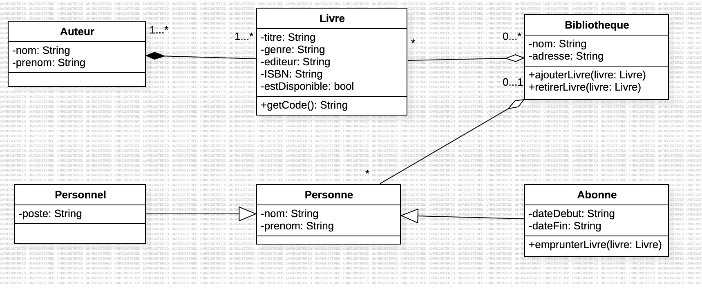

# UML Sandbox

Ce repository me sert de bac à sable pour mon apprentissage d'UML.

## Qu'est-ce que UML ?

Comme son nom l'indique, l'**Unified Modeling Language** est apparu en 1997 pour unifier et standardiser la modélisation des systèmes. Face à l'émergence de la POO et à la complexification du développement de logiciels, ce langage de modélisation graphique vise justement à **créer des représentations visuelles de systèmes complexes tout en facilitant la communication entre les différentes parties prenantes au développement** (développeurs, clients, chefs de projet...).

Il est né de la **fusion de plusieurs méthodes** :

- **Méthode Booch :** orientée objet et utilisée pour décrire les structures et comportements des systèmes.

- **Object-Modeling-Technique :** centrée sur les aspects structurels et dynamiques.

- **Cas d'utilisation :** concept clé pour modéliser les exigences.

## Comparaison avec [MERISE](https://github.com/EnguerranSGG/BDD-Sandbox/blob/main/MERISE/merise-course.md)

Déjà, il convient de préciser qu'UML n'est pas une méthode mais bien un langage à part entière. Ensuite, Merise est une approche relationnelle des données alors qu'UML est orienté objet.

UML est idéal pour les systèmes logiciels complexes, dynamiques et orientés objets, avec une couverture complète du cycle de vie.
Merise est mieux adapté aux systèmes d’information structurés, notamment pour la conception de bases de données relationnelles.

Pour conclure, ce sont deux choses qui peuvent se compléter le cas échéant, mais ce sont deux outils différents.

## Avantages et inconvénients

### Avantages

Pour commencer, l'universalisation d'UML lui permet de bénéficier d'un large écosystème d'outils, ce qui lui permet de s'intégrer dans différents environnements de développement.
De plus, du fait de sa large panoplie de diagrammes, UML couvre complètement le cycle de vie logiciel : de l'analyse et la conception aux tests et à la maintenance.

## Focus sur le diagramme de classe

Le diagramme de classe est un diagramme structurel. Il montre les différentes classes d'un système avec leurs attributs, méthodes et relations.

### Les attributs et les méthodes

Les attributs se trouvent dans la partie supérieure de la classe, tandis que les méthodes, appelées ici "opérations", se trouvent dans la partie inférieure. On place devant chacun les symboles +(public), -(privé), ou #(protected) pour spécifier leur accessibilité comme ci-dessous. Pour les opérations, il ne faut pas oublier les paramètres et les éventuels retours.

### Les différentes relations

- **Association :** Il s'agit d'une relation où les deux entités sont indépendantes l'une de l'autre dans le sens où aucune des deux ne fait intrinsèquement partie de l'autre.

- **Agrégation :** Il s'agit d'une relation où justement l'une des deux entités fait partie de l'autre. Cependant, si le "contenant" disparaît, l'autre partie ne disparaît pas pour autant. Dans le diagramme ci-dessus, les livres et personnes rattachés à la bibliothèque sont des parties prenantes à son fonctionnement mais ne vont pas pour autant disparaître si la bibliothèque est fermée. Cela est représenté par un losange creux vers le "contenant".

- **Composition :** À l'inverse, dans cette relation, si le contenant disparaît, le contenu n'a plus lieu d'être. Dans le cadre du diagramme ci-dessus, un livre ne peut pas exister sans auteur. Cela est représenté par un losange plein vers le "contenant".

- **Héritage :** Une classe va spécialiser ou généraliser une autre. Dans le diagramme ci-dessus, les classes "personnel" et "abonné" héritent de "personne". Cela est représenté par une flèche creuse partant des classes héritantes.

- **Dépendance :** Une classe utilise temporairement une autre. Cela est représenté par une ligne pointillée.

Ensuite, **ajoutez les multiplicités et les noms des relations si nécessaire**.

